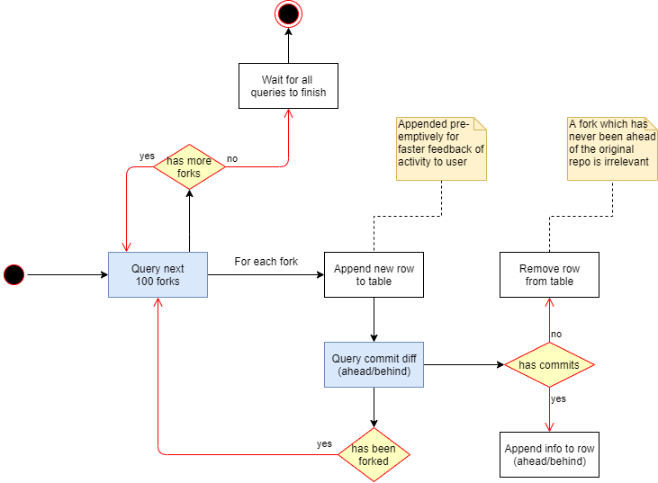

# Useful Forks

Adding a sorted list of starred forks to the GitHub forks page.
Results are filtered out if there were never any commits pushed since the fork was created.

This is meant to help with increasing the discoverability of useful forks of open-source projects.
Some times, a project might be abandoned, or someone had a different idea of how it should be implemented...
And when you go looking for those interesting forks, you find yourself searching through potentially hundreds of forks.

---

The project is released as:
1. A website: great for people that just want to use this tool every now and then.
2. A Chrome Extension: has the advantage of always performing the search whenever you open a project's GitHub Forks page.
3. A feature in [`refined-github`](https://github.com/sindresorhus/refined-github)

## Website
The project is [available online](https://useful-forks.github.io/) thanks to GitHub Pages.

You can query repository directly with the URL. Here is an example: https://useful-forks.github.io/?repository=kotcrab/vis-ui

## Chrome Extension (WIP)
Not published yet. If you want to install it:
1. Clone this repository
2. Change the [script file](project/useful-forks.js) so that it includes an [Access Token](https://github.com/settings/tokens/new?scopes=public_repo&description=UsefulForks).
3. Go to the `chrome://extensions` URL
4. Enable `Developer mode` (switch at the top-right)
5. Click `Load unpacked` (button at the top-left)
6. Select the [`project` folder](project)

Once it's activated, the extension will automatically trigger itself whenever you open a Fork page, as shown by the GIF below:

# How it works

This Activity Diagram (UML) should clarify a bit the inner-workings of the algorithm, and why it may some times require so many API calls.

## `refined-github`
[`refined-github`](https://github.com/sindresorhus/refined-github) is an ensemble of tools and tweaks aimed at improving your GitHub experience.

`useful-forks` is part of the dozens of features provided. In that context, it appears as a button which redirects you to the [`useful-forks` website](https://useful-forks.github.io/):

## For contributors
If you want to help, the structure of the repo is rather simple. In terms of folders:
* `docs` contains the website
* `project` contains the Chrome Extension

### To-do
* Fix the [Issues](https://github.com/useful-forks/useful-forks.github.io/issues) (if there are any)
* Cache responses for a little while 
  * https://docs.github.com/en/free-pro-team@latest/rest/guides/getting-started-with-the-rest-api#conditional-requests
  * https://docs.github.com/en/free-pro-team@latest/rest/overview/resources-in-the-rest-api#conditional-requests
  * https://stackoverflow.com/a/14890859/9768291
* Publish as a Chrome Extension (create 'options' and 'background' pages?)
  * See: https://developer.chrome.com/extensions/samples
    * https://developer.chrome.com/extensions/examples/tutorials/broken_background_color.zip
    * https://developer.chrome.com/extensions/examples/tutorials/getstarted.zip
  * Allow people to input their Access Token to increase API limits (from Extension's settings rather than through script)

# Credits
Thanks to [raeleus](https://github.com/raeleus) for his design of the logo!
